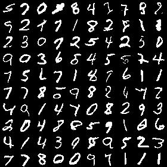
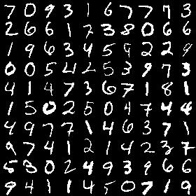
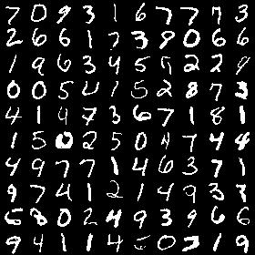

## PixelRNN

 A lasagne implementation of the MD-RNN proposed in the paper ["Pixel Recurrent Neural Networks"](https://arxiv.org/abs/1601.06759) by Aäron van den Oord, Nal Kalchbrenner and Koray Kavukcuoglu

### Overview

This repository features:
* Bi-Diag-LSTM
* Masked convolutions (also color channel masking)
* !! Proper shift down by 1 row of the right Diag-LSTM
* Residual connections
* Networks weights for MNIST
* 256-way softmax and sigmoid output layers
* Dynamic generation of MNIST images in an updating `matplotlib` window

TODO:
* ConvCNN
* Pyramid-RNN (Row-RNN)
* Train on CIFAR-10

The PixelRNN implementation can converge to a decent solution in a few epochs of training on MNIST.

### Dependencies
Compatible with `Python >= 3.3`.

System dependencies:
```
sudo apt-get install graphviz
```

Python dependencies:
```
pip install -r requirements.txt
```

### Examples

Images sampled (generated) from the Bi-Diag-LSTM:



Original images (left) and the same images with their lower half completed by the Bi-Diag-LSTM (right):

 

Three steps of the dynamic pixel-by-pixel generation of an image:


